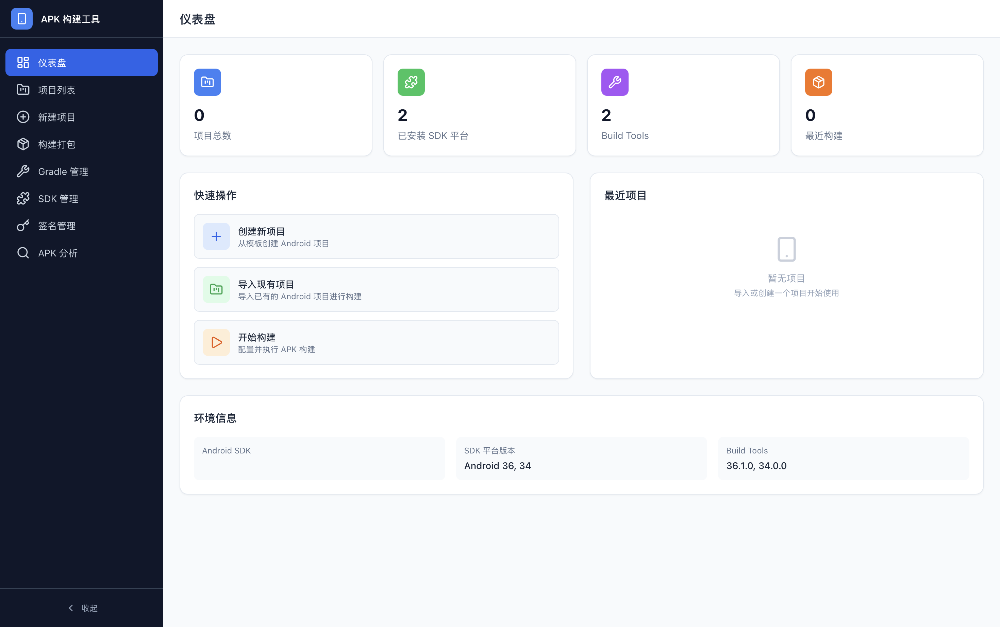
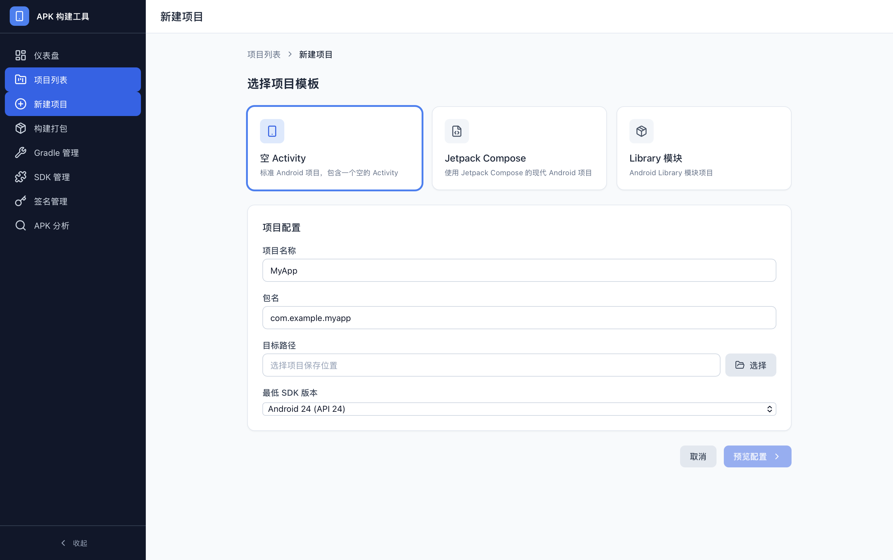
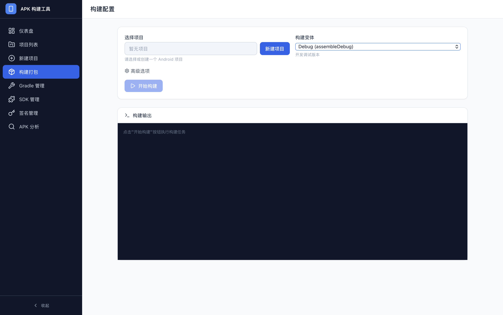
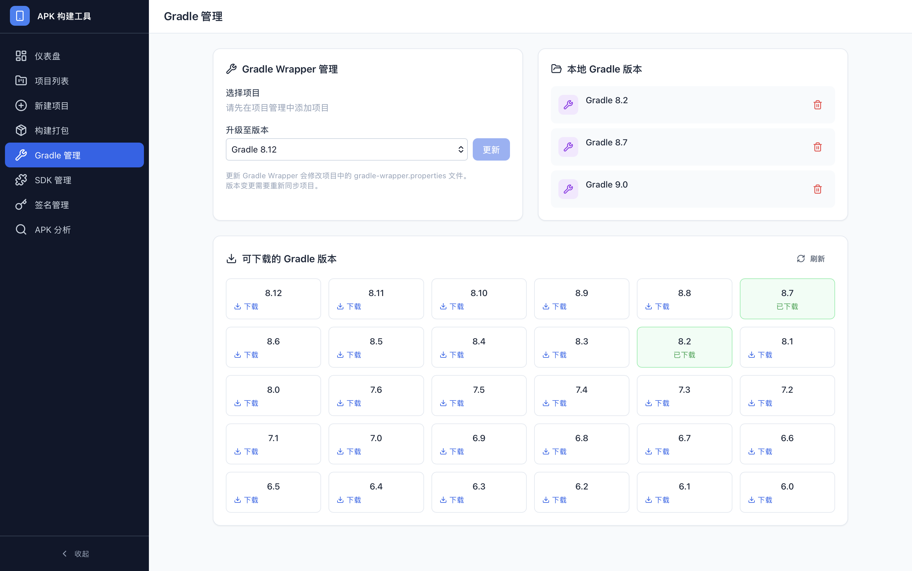
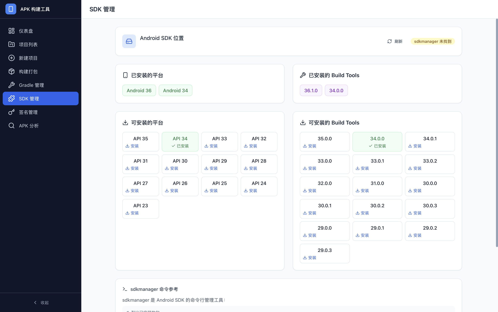
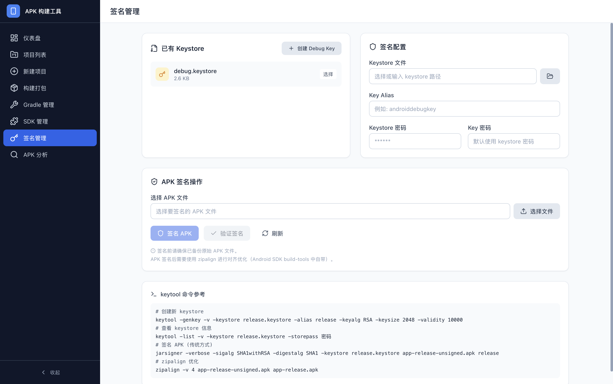

# ABM — Android Package Manager

<a href="README.en.md">English</a> | 简体中文

**APM** 是一款跨平台桌面应用，用于 Android APK 打包、签名和项目管理。基于 [Wails](https://wails.io)（Go）+ React + TypeScript 构建，体积轻量（≈8MB），运行流畅。

## ✨ 功能特性

### 📊 仪表盘
项目总数、SDK 环境概览、快捷操作入口。

### 📁 项目管理
导入已有的 Android 项目，或从模板（空 Activity、Jetpack Compose、Library 模块）快速创建新项目。

| 项目列表 | 新建项目 |
|:---:|:---:|
|  |  |

### 🔨 构建打包
自由选择构建变体（Debug/Release/AAB），设置 JAVA_HOME、传递额外 Gradle 参数，实时查看构建输出日志。

### ⚙️ Gradle 管理
- 查看所有本地缓存的 Gradle 版本
- 升级任意项目的 Gradle Wrapper
- 删除过期版本，释放磁盘空间

### 📱 Android SDK 管理
一键查看已安装的平台和 Build-Tools 版本，了解可安装的 SDK 组件。

### 🔐 APK 签名
- 列出并选择 keystore（debug / release）
- 使用 `apksigner` 签名 APK
- 验证 APK 签名状态
- 一键创建 debug keystore

### 🔍 APK 分析
选择 APK 文件，即时解析：
- 包名、版本名/版本号、SDK 目标版本
- 声明的权限和功能特性
- 签名验证结果

---

## 🚀 安装

### 下载预构建的应用包

> 💡 即将推出 — macOS、Windows、Linux 的预构建安装包会发布在 [GitCode Releases](https://gitcode.com/csdnjxx/ApkBuildTool/releases) 页面，敬请关注。

| 平台 | 架构 | 格式 |
|------|------|------|
| macOS | arm64 / x64 | `.app` / `.dmg` |
| Windows | x64 | `.exe` 安装程序 |
| Linux | x64 | `.AppImage` / `.deb` |

下载最新 Release，直接安装运行，无需配置任何开发环境。

### 系统要求

| 组件 | 要求 |
|-----------|----------|
| 操作系统 | macOS 12+, Windows 10+, Linux (GTK3) |
| Android SDK | 需设置 `ANDROID_HOME` 环境变量 |
| Java | JDK 17+（用于 Gradle 构建和 APK 签名） |
| AAPT | Android SDK Build-Tools 自带 |

---

### 技术栈

| 层 | 技术 |
|-------|-----------|
| 桌面框架 | [Wails v2](https://wails.io) |
| 后端 | Go 1.26 |
| 前端 | React 19, TypeScript, Vite 8 |
| 样式 | Tailwind CSS 3 |
| 图标 | Lucide React |
| 状态管理 | Zustand |
| APK 解析 | Android SDK `aapt` + `apksigner` |

---

## 📄 开源协议

MIT
